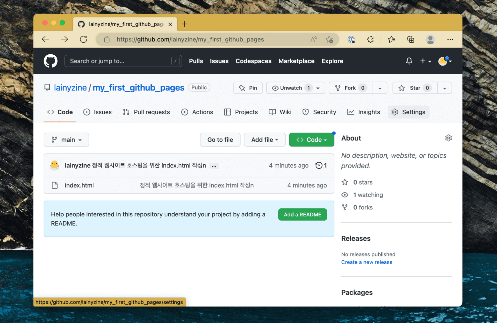
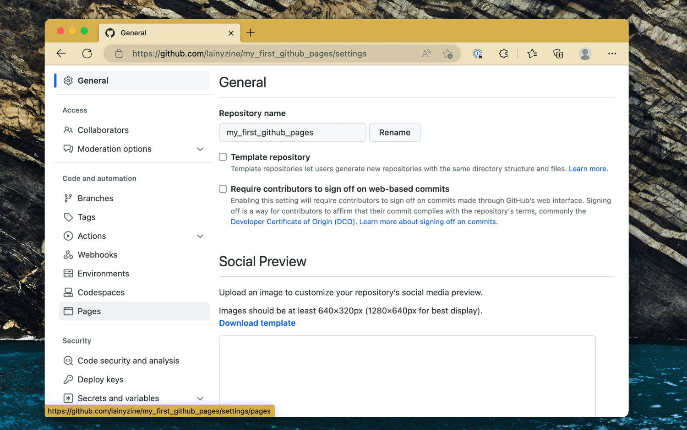
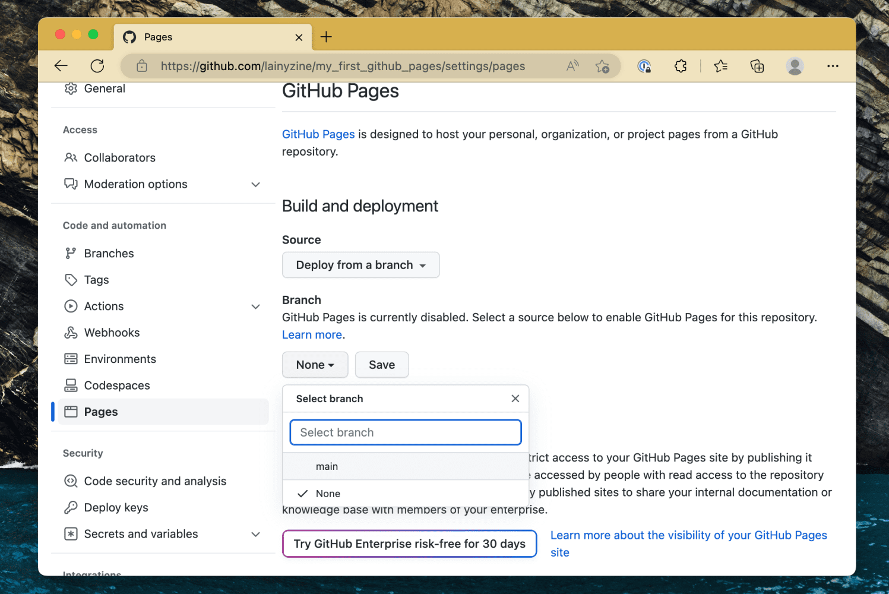
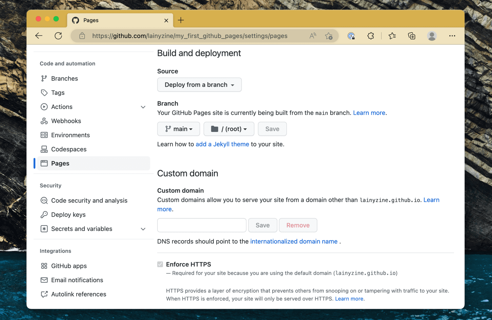

# recovery_css

사용법

GitHub Pages 활성화

<h3>1. 상단의 Settings >> 좌측의 Code and automation >> Pages</h3>

<h3>2. Branch >> Master 또는 Main 선택 후 Save</h3>

<h3>3. 그러면 공유 완료이다.</h3>

기본 주소는 kkt3343.github.io 이다.

파일 경로는 kkt3343.github.io/[repository]/하위폴더

ex) kkt3343.github.io/recovery_css/dogdrip.css

